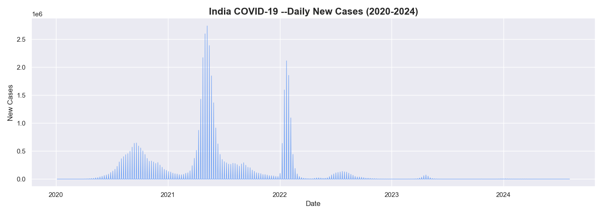
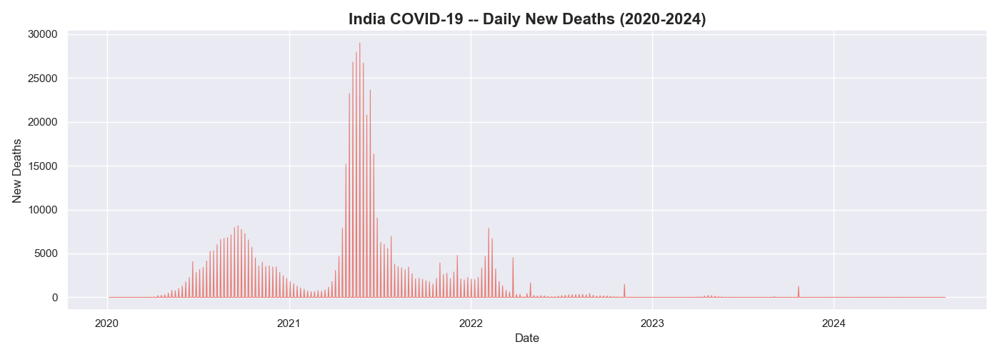
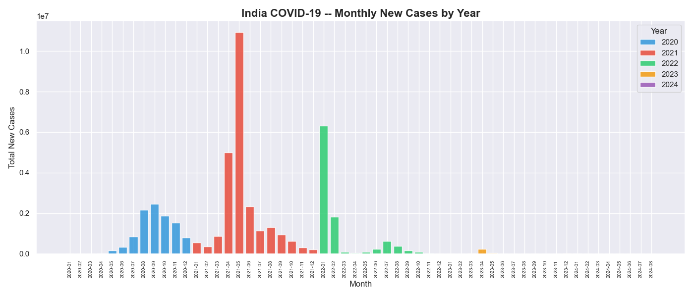
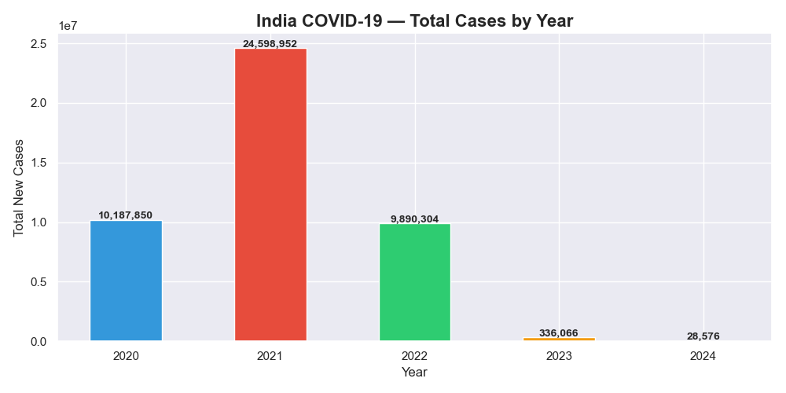
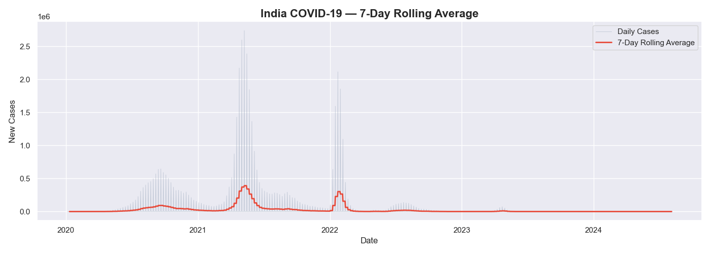

# India COVID-19 Trend Analysis 📊

## Overview
Analysis of India's COVID-19 data (2020–2024) using 
real WHO data with 4,29,435 rows.

## Tools Used
- Python (Pandas, Matplotlib, Seaborn)
- Power BI Dashboard
- Jupyter Notebook

## Key Insights
- 2021 was worst year — 2.46 Crore cases (Delta wave)
- Peak single day: 27,38,957 cases
- 3 clear waves: 2020, 2021, 2022
- Cases dropped 99% from 2021 to 2023
- Total Deaths: 5,33,623

## Charts

